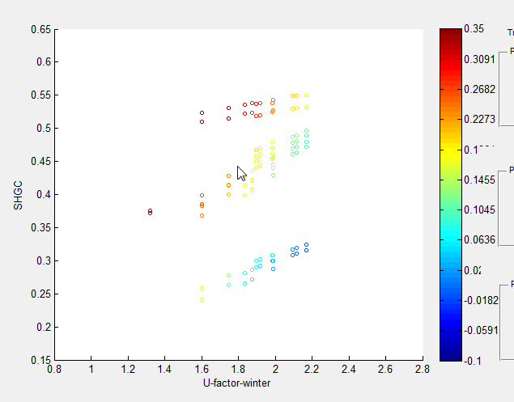

# Airflow algorithm for vertical venetian blinds for BSDF window model

Simon Vidanovic

Lawrence Berkeley National Laboratory

## Overview

In last couple of years LBNL has been working extensively on generating new procedure for window attachment ratings. In that process, WINDOW 7 and EnergyPlus calculation engines are used extensively to produce and analyze results.
Last year new airflow algorithm was implemented for horizontal venetians (https://github.com/NREL/EnergyPlus/blob/issue-6790-VRP-D-term/design/FY2017/AERC_Improvements.md).
Also in a process of testing new airflow algorithm, some bugs are discovered and fixed and will be part of this release.

## Justification for New Feature

Correlation coefficients are proposed for the ISO 15099 algorithm that reduced the mean error between measured and simulated heat flux from 13% to 1% for vertical blinds.

## E-mail and Conference Call Conclusions

## Approach

Current BSDF window model (tarcog) will be updated for proposed changes.

## Testing/Validation/Data Sources

Program will be tested against series of input files generated for AERC project. Test series will include representative subset of windows varied over shading device openness, IR transmittance and conductivity. Results will be compared for different IGU configurations. One example for such comparison is given in Figure 3.

*Figure 3. AERC Results*

Results need to show agreement between U-value, SHGC and energy use.

## Input Output Reference Documentation

There will be change in input/output reference document related to WindowMaterial:ComplexShade where additional layer type will be supported.

## WindowMaterial:ComplexShade 

This input object is used to define shade layers used in the [Construction:ComplexFenestrationState](https://bigladdersoftware.com/epx/docs/8-7/input-output-reference/group-surface-construction-elements.html#constructioncomplexfenestrationstate) object.

### Inputs 

#### Field: Name 

Unique name of the shading layer.

#### Field: Shading Layer Type 

The type of shading layer. The options are:

- VenetianHorizontal – for modeling horizontal venetian blinds
- VenetianVertical - for modeling vertical venetian blinds
- Woven – for modeling shading systems with a regular weave
- Perforated – for modeling perforated screens
- BSDF – for modeling shades whose properties are represented by a BSDF file
- OtherShadingType – for modeling shading systems which do not belong to the any of the previous group

## Updated IDD Object

WindowMaterial:ComplexShade,  
    \memo Complex window shading layer thermal properties  
     \min-fields 12  
  A1 , \field Name  
       \required-field  
       \type alpha  
       \reference WindowComplexShades  
  A2 , \field Layer Type  
       \type choice  
       \key VenetianHorizontal  
       \key VenetianVertical  
       \key Woven  
       \key Perforated  
       \key BSDF  
       \key OtherShadingType  
       \default OtherShadingType  
  N1 , \field Thickness  
       \type real  
       \units m  
       \minimum> 0  
       \default 0.002  
  N2 , \field Conductivity  
       \units W/m-K  
       \type real  
       \minimum> 0  
       \default 1  
  N3 , \field IR Transmittance  
       \type real  
       \maximum 1  
       \minimum 0  
       \default 0  
  N4 , \field Front Emissivity  
       \type real  
       \maximum 1  
       \minimum 0  
       \default 0.84  
  N5 , \field Back Emissivity  
       \type real  
       \maximum 1  
       \minimum 0  
       \default 0.84  
  N6 , \field Top Opening Multiplier  
       \type real  
       \minimum 0  
       \maximum 1  
       \default 0  
  N7 , \field Bottom Opening Multiplier  
       \type real  
       \minimum 0  
       \maximum 1  
       \default 0  
  N8 , \field Left Side Opening Multiplier  
       \type real  
       \minimum 0  
       \maximum 1  
       \default 0  
  N9 , \field Right Side Opening Multiplier  
       \type real  
       \minimum 0  
       \maximum 1  
       \default 0  
 N10 , \field Front Opening Multiplier  
       \type real  
       \minimum 0  
       \maximum 1  
       \default 0.05  
 N11 , \field Slat Width  
       \units m  
       \type real  
       \minimum> 0  
       \default 0.016  
 N12 , \field Slat Spacing  
       \note Distance between adjacent slat faces  
       \units m  
       \type real  
       \minimum> 0  
       \default 0.012  
  N13 , \field Slat Thickness  
       \note Distance between top and bottom surfaces of slat  
       \note Slat is assumed to be rectangular in cross section and flat  
       \type real  
       \units m  
       \minimum> 0  
       \default 0.0006  
  N14 , \field Slat Angle  
       \type real  
       \units deg  
       \default 90  
       \minimum -90  
       \maximum 90  
  N15 , \field Slat Conductivity  
       \type real  
       \units W/m-K  
       \minimum> 0  
       \default 160.0  
  N16 ; \field Slat Curve  
       \note this value represents curvature radius of the slat.  
       \note if the slat is flat use zero.  
       \note if this value is not zero, then it must be > SlatWidth/2.  
       \type real  
       \units m  
       \minimum 0.0  
       \default 0  

## Engineering Reference

Change to engineering reference will be minimal since there is no change in model except for equations. Following section should be updated

### Homogeneous Diffuse Shade, Perforated Screens and Woven Shade

Correlations for homogeneous diffuse shade, perforated screens and woven shade are:

$$
A_{h} =C_{1} \cdot (d_{surface})^{C_{2}} \cdot A_{s} \\

A_{l,r}^{*} = C_{3} \cdot A_{l,r} \\

A_{top, bot}^{*} = C_{4} \cdot A_{l,r} \\

k^{*} = d_{surface} \cdot k_{c}+(1-d_{surface}) \cdot k_{s}
$$

Where for horizontal blinds:

$$
C_{1} = 0.05 \\

C_{2} = 1.08 \\

C_{3} = 0.79 \\

C_{4} = 0.50
$$

while for vertical venetian coefficients are:

$$
C_{1} = 0.041 \\

C_{2} = 0.00 \\

C_{3} = 0.270 \\

C_{4} = 0.012
$$
