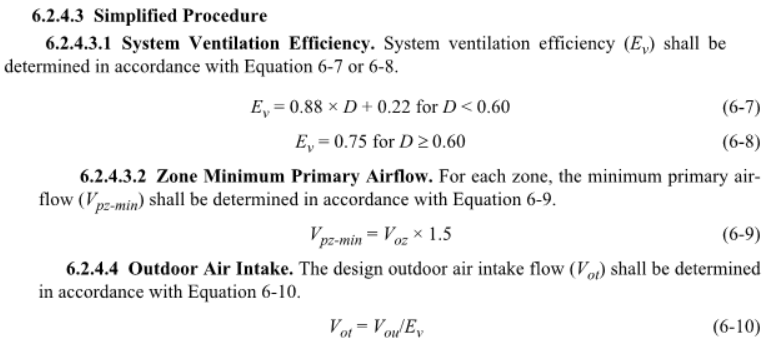

# ASHRAE 62.1-2019 Simplified Procedure
Jeremy Lerond, Wooyoung Jung, Jian Zhang, PNNL

May 2021

# Justification for New Feature
The latest version of ASHRAE Standard 62.1 introduces a new approach to calculate a multi-zone system's design outdoor air intake and corresponding minimum primary zone airflows. This new approach is a simplification of the previous method, the Ventilation Rate Procedure (VRP). Language from the standard is provided below.

The Simplified Procedure (SP) is required by ASHRAE Standard 90.1 in order for reheat terminal boxes serving zones having thermostatic DDC controls to reheat the primary air if the minimum primary air flow rate meets the SP ventilation requirements (see section 6.5.2.1, exception 2.a.(1)).

EnergyPlus has currently the capability to calculate the design outdoor air flow rate intake of a multi-zone system using the VRP but not using the SP. This new feature would allow users to let EnergyPlus size/calculate a system's air flow intake based on the SP and size/calculate the corresponding zone terminal minimum primary air flows.

# References
* ASHRAE. 2019. ANSI/ASHRAE/IES 90.1-2019, Energy Standard for Buildings Except Low-Rise
Residential Buildings. ASHRAE, Atlanta, GA

* ASHRAE. 2019. ANSI/ASHRAE 62.1-2019, Ventilation for Acceptable Indoor Air Quality. ASHRAE, Atlanta, GA