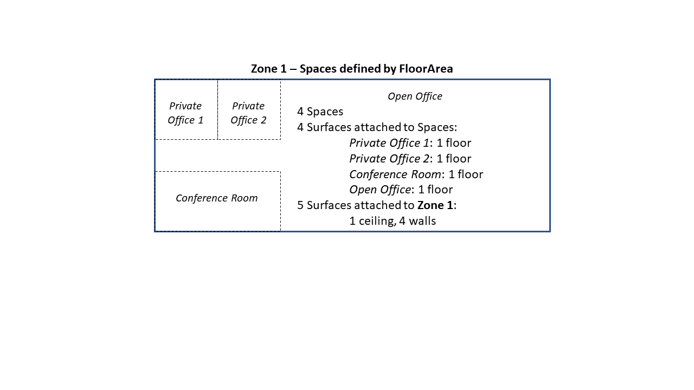
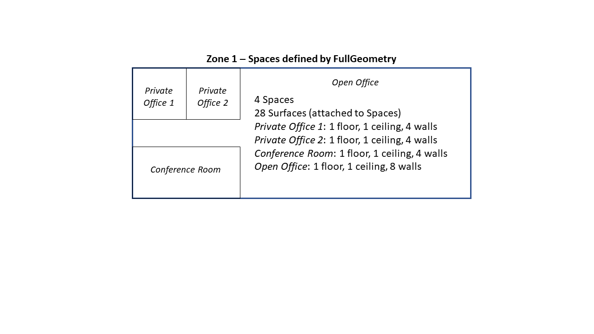

# Adding "Spaces" to EnergyPlus #

**Michael J. Witte, GARD Analytics, Inc.**  
**Jason W. DeGraw, ORNL**  
**With input from many more . . .**  

 -  Original, November 22, 2019
 -  Revised, April 1, 2020
    * Keep the current definition of Zone
    * Add new objects for Space, SpaceType, CompoundSpaceType, and Enclosure
 -  Revised, November 25, 2020
    * Condensed and focused on final proposal somewhat agreed to back in April 2020
    * Revised to reflect simplified Construction:AirBoundary object (radiant and solar enclosures are now the same)
 -  Revised, December 11, 2020
    * Simplify transition rules by allowing Zone and Space to share names
    * Per comments, decide that load assignments like internal gains, infiltration and ventilation, should be at the Space level
    * Add language to clarify concerns raised in comments
    * Add daylighting and thermal comfort considerations
 - Revised, May 11, 2021
    * Make Space optional for input
    * Add three options to define Space: FractionOfZone, FloorArea, FullGeometry
    * Make Space Type just a tag
    * Add Compliance:Space for additional tags
    

## Justification for New Feature ##

### More Straightforward Input
Thermal zones (HVAC zones) are often composed of a variety of spaces grouped together to be served by
a single thermostat. Currently, the user (or interface) must blend these spaces together for surfaces,
internal gains, and other specifications. The option to specify each space explicitly would greatly simplify input in data managemenent,
especially for space-based interfaces (such as OpenStudio) and for codes and standards modeling.

### Reporting by Space Type
For standards and other purposes, reporting by space type is essential.

### Radiant and Solar Exchange
Other possible advantages include better surface groupings for radiant and solar exchange. For example, a private office which is part of a large 
HVAC zone could be modeled as a space so that it does not pass solar or radiant to other surfaces in the larger zone. 
There are also potential computing performance advantages to dividing zones into smaller enclosures for radiant exchange and solar
distribution, especially for large HVAC zones with many surfaces.

## Proposed Input Approach ##
New Space object (and related objects) with minimal changes to current inputs.

 * Zone object does not change
 * *New optional Space object with Space Type tag.*
 * *New Compliance:Space object* for standards-related tags.
 * *Three space geometry options:* 
   * FractionOfZone: Specify fraction of zone floor area for the Space
   * FloorArea: Area based on floor surface(s) attached to the Space
   * FullGeometry: Define the Space with surfaces on all sides.
 * *New SpaceList object* (equivalent to ZoneList, but for Spaces).
 * Surfaces will reference a Zone *or Space*.
 * Internal gains reference Zone or ZoneList, *Space or Spacelist*.
 * ZoneInfiltration:* and ZoneVentilation:* reference Zone or ZoneList, *Space or Spacelist*.
 * Daylighting controls will reference a Zone *or Space*. (Daylighting reference points see all windows in an enclosure).
 * Thermostats remain as-is and continue to reference a Zone or ZoneList.
 * ZoneHVAC remains as-is and continues to reference a single Zone.
 * *New DesignSpecification:OutdoorAir:List object* to list OA requirements by Space.
 * Sizing:Zone references a DesignSpecification:OutdoorAir *or DesignSpecification:OutdoorAir:List object.*

### Proposed Input Changes:

    Space,  !- Optional new object
      Space Name,
      Zone Name,
      Geometry Method - FractionOfZone, FloorArea, or FullGeometry
      Fraction of Zone Area
      Space Type Tag
			*Optional Fields for FullGeometry*      
      Origin,
      ...
      
    Zone, !- No change
      Name,
      
      Origin,
      ...
      
    Lights/People/Equipment
      Name,
      Zone, ZoneList, Space or SpaceList Name,
      Schedule Name,
      ...
    
    Infiltration:* and Ventilation:*
      Name,
      Zone, ZoneList, Space or SpaceList Name,
      ...
    
    Surface,
      Name,
      ...
      Zone or Space Name,
      ...
      
    Compliance:Space !- Optional new object
    Space Name,
    Tag 1,
    Tag 2,
    ...

    DesignSpecification:OutdoorAir:List  !- Optional new object
    List Name,
    Space Name 1,
    Design Specification Outdoor Air Object Name 1,
    Space Name 2,
    Design Specification Outdoor Air Object Name 2,
    ...
    
       

## Sizing Considerations ##

 * Zone sizing calculations and reports are all at the Zone level. 
 * Possible future work could add Space level sizing calculations and reports for FullGeometry Spaces.
 
## Testing/Validation/Data Sources ##

* For new example files with Spaces added, there should be no substantive diffs 
compared to the equivalent file without Spaces. There will likely be some small diffs due to 
changes in computational order or accumulating space-level values. 
* For the regression tests with no Spaces, all numeric results
should stay exactly the same, but some table headings may change.

## Input Output Reference Documentation ##

* New docs for Space, SpaceList, Compliance:Space, and DesignSpecification:OutdoorAir:List.
* Add Space or SpaceList options to other objects where applicable.

## Outputs Description ##

* Zone-level output variables will remain the same.
* Some space-level output variables may be added.
* Table reports summarizing inputs at the zone level will remain the same.
* Table reports summarizing inputs at the Space Type level will be added.
* Table reports allocating energy at the Space Type level *may* be added.
* Space-level outputs would include:
  * Internal gains attached directly to a Space.
  * Internal gains attached to a Zone apportioned by Space floor area.
  * Floor area for each Space.
  * Walls and other surfaces would only be reported at the Space level for FullGeometry Spaces.

## Engineering Reference ##

The basic calculations will not change, so changes will be minimal to clarify Space, Zone, and Enclosure.

## Example File and Transition Changes ##

* No transition required.
* Take one or more example files and add Spaces (using all three space geometry options).

##  Relationship Assumptions
*(getting deep in the weeds here)*

### Current EnergyPlus model ###
EnergyPlus input currently has the following (very flat) heierarchy:

    Zone
        Surfaces (references a zone name)
        People, Lights, etc. (references a zone name or zone list name)
        Thermostat (one per zone)
        HVAC equipment (attaches to a zone)

Zones represent an air mass (air node) that exchanges heat with surfaces, internal loads, HVAC equipment, etc. 
A Zone is essentially the "atomic unit" of the building. By default a zone has a uniform air temperature, but there are room air models 
that allow modeling of stratification and other non-uniform temperature effects. Thermostats and HVAC equipment are assigned per Zone.

The internal data model adds another layer:

    Enclosure
        Zone
            Surfaces
            People, Lights, etc.
            Thermostat
            HVAC equipment
        Zone
            Surfaces
            People, Lights, etc.
            Thermostat
            HVAC equipment

Enclosures are used for radiant and solar/daylighting exchange. Enclosures are primarily concerned with Surfaces, but they
are also related to internal gains (which cast radiant and visible energy into the enclosure) and thermal comfort (MRT). 
By default there is one Enclosure for each Zone.  By using Construction:AirBoundary, multiple zones may be grouped into a single larger Enclosure. 
Enclosures are assigned automatically based on the zones connected by an air boundary surface. 

### Proposed model with new Space layer ###

* Keep the current definition of "Zone".

* Add "Space" (<= Zone).

* Space objects will be optional in input, but required in the data model. 
So if a Zone has no Space defined in input, a Space will be generated automatically.

        Zone 1
            Space 1
                Surfaces
                Internal Gains (People, Lights, etc.)
        Zone 2
            Space 2
                Surfaces
                Internal Gains (People, Lights, etc.)
            Space 3
                Surfaces
                Internal Gains (People, Lights, etc.)
    
        Enclosure A (two spaces with at least one air boundary connecting them into a single enclosure)
            Space 1
                Surfaces
                Internal Gains (People, Lights, etc.)
            Space 2
                Surfaces
                Internal Gains (People, Lights, etc.)
    
        Enclosure B (one space defining the entire enclosure)
            Space 3
                Surfaces
                Internal Gains (People, Lights, etc.)
                
        ZoneHVAC
            Zone 1
               Thermostat
               HVAC Equipment
            Zone 2
               Thermostat
               HVAC Equipment
            Zone 3
               Thermostat
               HVAC Equipment
        
    
### Definitions

 * Surface - A geometric plane which is attached to a Space. 
   * A Surface can be opaque, transparent, or an air boundary.
   * Each Surface belongs to one Zone and one Space.
   * Inter-Space Surfaces (adjacent to another Space) are modeled the same as current inter-Zone surfaces (two linked surfaces).
   * Inter-Space surfaces connecting spaces that are part of the same Zone will see the same air temperature but may be in 
     different enclosures. If they connect spaces that are in different Zones, then they will see different air temperatures as well.
   * Air boundary surfaces will combine one or more spaces and/or zones into an enclosure.

 * Space - A collection of one or more Surfaces and internal gains or a fraction of a Zone.
   * Each Space belongs to one Zone (explicitly user-assigned).
   * Spaces may be defined by FractionOfZone, FloorArea, or Full Geometry (surfaces) .
   * Each Space belongs to one Enclosure (implicitly assigned).
   * There is no heat balance at the Space level. (This could be added in the future for Sizing only for FullGeometry Spaces).

 * Space Type - Just a tag on Space

 * Zone - An air mass connecting Surfaces, internal gains, and HVAC equipment for heat balance and HVAC control.
   * Each Zone is comprised of one or more Spaces.
   * If no Spaces are defined for a zone, a Space will automatically be created.
   * All Surfaces and internal gains associated with the Spaces are included in the Zone.
   * Surfaces and internal gains may also be attached directly to the Zone.
   * The Zone heat balance does not change: it has an air temperature (or a Room Air Model) and includes all Surfaces and 
   internal gains from its Spaces. 
   * Every Zone with HVAC connected has its own air node and its own air temperature and humidity.

 * Enclosure - A continuous volume connecting Surfaces for radiant, solar, and daylighting exchange.
   * Each Enclosure is comprised of one or more Spaces.
   * There is one Enclosure for each Space unless there are air boundary surfaces 
   which group multiple Spaces into a single Enclosure.
   * All Surfaces and internal radiant gains associated with the Spaces are included in the Enclosure.
   * Enclosures only distribute radiant (thermal), solar, and visible energy to and from the Surfaces.
   * There is no full heat balance at the Enclosure level. Each Enclosure only balances the radiant/solar flux on each 
   Surface. These fluxes then become part of the Surface inside heat balance.

## Data Structure Considerations ##

 * Add fields to `Surface` to track the Space name and index along with the existing Zone and Enclosure fields.
 
 * Proposed Surface ordering (same as current): 
   - All shading surfaces are first
   - All air boundary surfaces are next.
   - Group by Zone
   - Group by surface type within each Zone

e.g., Zone1 contains Space1 and Space3, Zone2 contains Space2.

      Shading Surfaces
      Air Boundary Surfaces
      Space1-OpaqueSurface1 (begin surfaces in Zone1)
      Space1-OpaqueSurface2
      Space3-OpaqueSurface1
      Space3-OpaqueSurface2
      Space1-Window1
      Space1-Window2
      Space2-OpaqueSurface1 (begin surfaces in Zone2)
      Space2-OpaqueSurface2
      Space2-Window1

 * Alternate Surface ordering: 
   - All shading surfaces are first
   - All air boundary surfaces are next
   - Group by Enclosure (because enclosure radiant exchange is more computationally intensive than zone heat balance?)
   - Group by Space within each Enclosure.
   - Group by surface type within each Space
   - Modify heat balance Zone loops to be Space loops(?)

e.g., Enclosure1 contains Space1 and Space3, Enclosure2 contains Space2.

      Shading Surfaces
      Air Boundary Surfaces
      Space1-OpaqueSurface1 (begin surfaces in Enclosure1)
      Space1-OpaqueSurface2
      Space1-Window1
      Space1-Window2
      Space3-OpaqueSurface1
      Space3-OpaqueSurface2
      Space2-OpaqueSurface1 (begin surfaces in Enclosure2)
      Space2-OpaqueSurface2
      Space2-Window1

## OLD: Questions for Discussion
 * Keep ZoneVentilation and ZoneInfiltration at the Zone level or move to the Space level (and rename)?

   *Move to Space level and rename to Ventilation:* and Infiltration:*.
   
 * Allow Zone Names to be the same as Space Names or force all names to be unique across Spaces and Zones?
 
   *Allowing the same names would simplify backward compatibility.*
 * Zone-based or Enclosure-based surface grouping?
 
   *This is a design question, somewhat premature at this point.*
   

